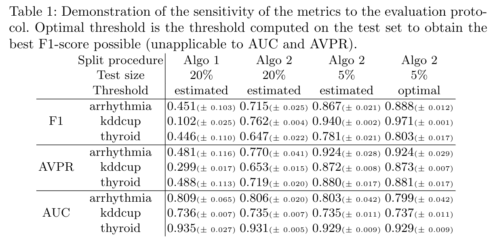
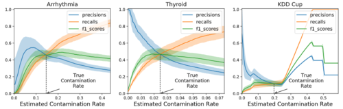
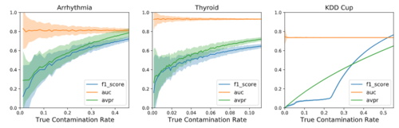
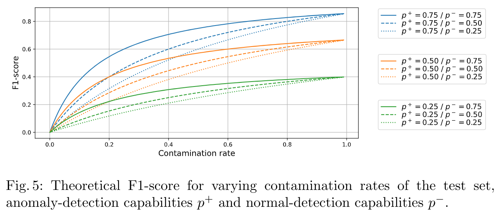
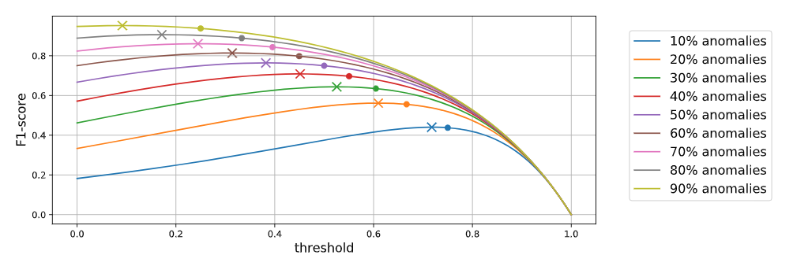
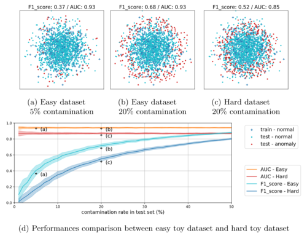

# Anomaly Detection: How to Artificially Increase your F1-Score with a Biased Evaluation Protocol

This is the code used to produce the results of the paper
[Anomaly Detection: How to Artificially Increase your F1-Score
with a Biased Evaluation Protocol](https://arxiv.org/abs/2106.16020).
The documentation of the code, generated by sphinx, is available
[here](https://euranova.github.io/F1-Score-is-Biased/html/index).

Please cite as 
```
@article{fourure2021anomaly,
  title={Anomaly Detection: How to Artificially Increase your F1-Score with a Biased Evaluation Protocol},
  author={Fourure, Damien and Javaid, Muhammad Usama and Posocco, Nicolas and Tihon, Simon},
  journal={arXiv preprint arXiv:2106.16020},
  year={2021}
}
```

## Environment Setup

### Python Environment

The code is developped and tested with *Python 3.6.9* and *pip 21.1.3*.
We strongly recommand to use a virtual environment like *conda* or *virtualenv* (with *virtualenv-wrapper*). 

### Installation

The *requirements.txt* file contain all needed dependencies.
You can install all the packages by running the following command line.

`pip install -r requirements.txt`

### Datasets

By default datasets are not in the repository but are automatically downloaded the first time you run the code. Datasets are saved in the *datasets* folder.

## Reproducing the Results

We provide multiple notebooks and a script to reproduce the results presented in the paper.
You will find below the steps to reproduce our main results:

* [Table 1](#table-1-demonstration-of-the-sensitivity-of-the-metrics-to-the-evaluation-protocol) - Demonstration of the Sensitivity of the Metrics to the Evaluation Protocol
* [Figures 2 and 3](#metrics-per-contamination-estimation-figures-2-and-3) - Metrics per Contamination Estimation
* [Figure 4](#metrics-per-true-contamination-rate-figure-4)  - Metrics per True Contamination Rate
* [Figures 5 and 6](#theoretical-f1-score-figures-5-and-6) - Theoretical F1-Score
* [Figure 7](#toy-dataset-experiments-figure-7) - Toy Dataset Experiments

You can launch a notebook environment with the following command line.
`jupyter notebook`


### Table 1 - Demonstration of the Sensitivity of the Metrics to the Evaluation Protocol



The script *f1_hack.py* produces the results presented in Table 1.
It can be run using the following command line.

`python f1_hack.py`

By default, the results for the KDD Cup dataset are not computed as computing these can take up to several hours.
You can change the used datasets with the `datasets` argument.

`python f1_hack.py -d arrhythmia -d kddcup -d thyroid`

You can also change the settings of the experiments with the `settings` argument,
as explained when running
`python f1_hack.py --help`
(see details in the paper).

`python f1_hack.py -d arrhythmia -d kddcup -d thyroid -s 1.2e -s 2.2e -s 2.05e -s 2.05o`

## Metrics per Contamination Estimation (Figures 2 and 3)




The notebook file *Metrics per contamination estimation (Fig2&3).ipynb* shows the evolution of different metrics (F1-score, precision, recall) according to the estimated contamination rate.
It also produces an example of a ROC curve and a precision recall curve.

You can change the dataset by changing the *dataset_name* variable in the second cell of the notebook.

## Metrics per True Contamination Rate (Figure 4)



The notebook file *Metrics per true contamination rate (Fig4).ipynb* shows the evolution of F1-score, AUC and AVPR according to the true contamination rate of the test set.

You can change the dataset by changing the *dataset_name* variable in the second cell of the notebook.


## Theoretical F1-Score (Figures 5 and 6)




The notebook file *Theoretical F1-Score (Fig5&6).ipynb* produces Figures 5 and 6, which present the theoretical evolution of F1-score for different contamination rates of the test set (Figure 5) and for different thresholds (Figure 6).

## Toy Dataset Experiments (Figure 7)



The notebook file *Toy Dataset Experiments (Fig7).ipynb* reproduces the toy example illustrations (Figure 7).
